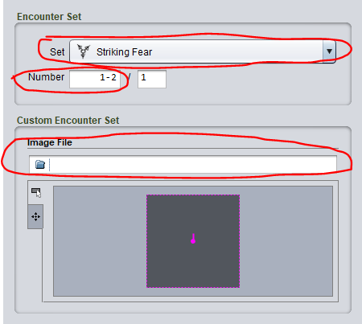
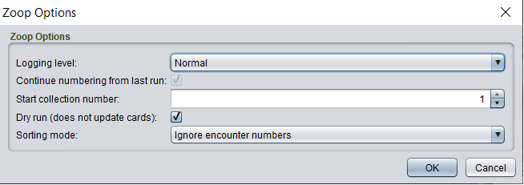
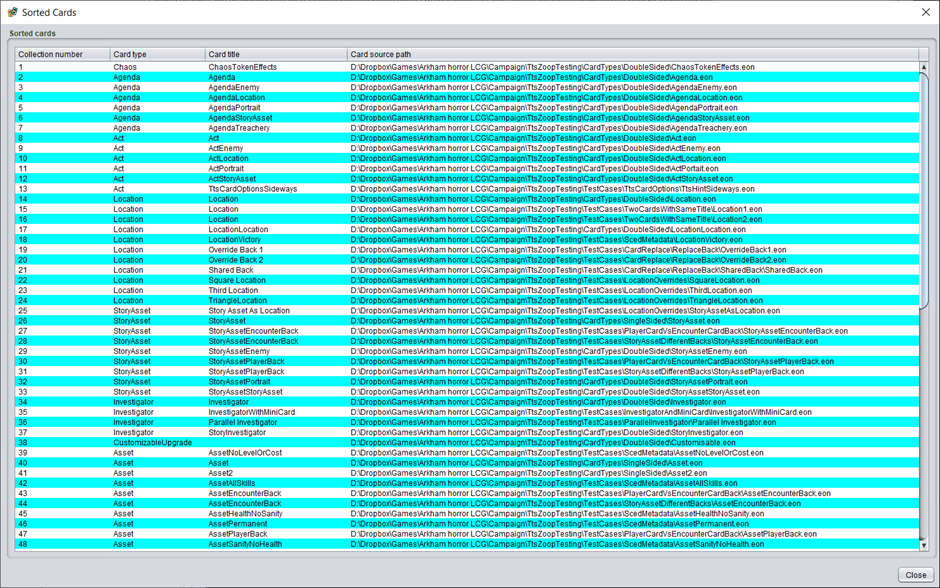

# Automatic numbering - collection and encounter

**This feature updates your .eon files. It is recommended you backup your content before using this feature.**

Zoop has a tool to set the collection and encounter numbers of your cards instead of doing it manually.

## Preparation

Before running the tool, some manual effort is required if you want encounter numbering to be updated by the tool. The manual items that must be set are

- The encounter set of each card, either using the dropdown or a custom image
- The encounter number of each card

Here's a picture of the relevant fields.

Firstly you must set the encounter set. Encounter sets can either by set via the dropdown (this requires that you have added customer encounter sets to the Strange Eons Preferences first) or as direct path to a custom image.

Secondly you must set the number field. This field is either a single number or a 'range' of the form X-Y where X and Y are numbers. You only need to specify this field such that Zoop can understand how many copies of the field are required. For example specifying ANY single number specifies there is only 1 copy of this card in the encounter set. Entering a range specifies there is more than 1 card. For example entering 1-3 specifies there are 3 copies of the card. You do NOT need to specify contigious numbers/sequences within an encounter set. Specifying 1 for each 'single' card and '1-X' for each range card is sufficient.

You do NOT need to set the other field in the above picture which is the encounter total. Zoop will work this out for you.

## Usage

Select **one or more** folders containing content to set collection numbers on. Please note that **any existing collection numbers will be replaced**. Each selected folder will have collection numbers set **in the order you selected the folders**.
As a simple example, if you have a project with one folder per scenario you should do the following

1. Select the folder containing the first scenario in the campaign
2. Hold Control (or your systems multi-select key)
3. Select the folder containing the second scenario in the campaign
4. Repeat step 3 for each subsequent scenario
5. Right click and select automatic collection numbering

Zoop will sort and set the collection number of the cards in the first selected folder, then repeat for each subsequent folder, incrementing the collection number across the entire process.

Designers have different project structures so if you organise your content in a different way Zoop provides a couple of basic options to tweak the process.

You will first see the option dialog

The options are

| Option | Details |
| --- | --- |
| Logging Level | Generally, you can leave this on Normal. If you want more details or feedback on the process set it to the other options for more logging. This does not impact the behaviour or output in any way |
| Continue numbering from last run | If this option is selected the Start collection number will be set to 1 greater than the last collection number generated by the last non-Dry run of this tool. Note that this option is only available if:  - The collection numbering has been run already since starting Strange Eons  - The project hasn’t changed since the last run  Further note that if Dry run option is used the last collection number is not stored for future runs. Only real (Dry run unchecked) runs will update this number for future runs. | 
| Start collection number | The number to start with. You may wish to use this to incrementally number your content across multiple runs of the tool.  For example if you organise your content in to multiple Strange Eons projects, but want a single consistent numbering scheme across those projects you would need to run the tool multiple times and use this option to start the second and any subsequent runs at 1 greater than the final number in the previous run. |
| Dry run | This option is enabled by default. When enabled the process will do the sorting, display the result for review, but not update any cards. It is recommended you test the tool with this option to check the numbering is suitable before applying it by running again with Dry Run disabled. 

After you have set the options, the process will execute and you will see the a table showing the selected cards sorted into order.

You should review the output for correctness. There is currently no ability to manually edit this ordering.

When you click Close you will be prompted to confirm updating the cards (only in non-Dry Run mode). Then you will see the progress dialog reporting updating each card. Note in Dry Run mode the updating is still reported but will indicate it has been skipped.

## Ordering logic

The ordering logic is described below. The logic is described as set of rules listed in priority order. When cards are being sorted a rule higher in the list will take priority over a rule lower in the list

- Encounter Set identity
    - The name of the encounter set OR the image path used for the ‘Custom encounter set’ option
- Card type of the front face of the card in the following order
    - Scenario/Campaign Rules
    - Chaos token effects
    - Agendas
    - Acts
    - Locations
    - Story Assets
    - Keys
    - Weakness Treacheries
    - Weakness Enemies
    - Stories
    - Investigators
    - Everything else
- Scenario/Rules page numbers
    - The page number that appears at the bottom of scenario/rules cards
- Agenda or Act set
    - This is the letter of the agenda or act to ensure cards sets comprising multiple agenda or acts decks are sorted correctly (for example an a/b deck and a c/d deck)
- Agenda or Act number
    - The typical ordering of an agenda or act deck, e.g. 1a/1b, 2a/2b, 3a/3b
- Player card class
    - Single class is ordered before dual class which is ordered before triple class etc
    - Then ordered by individual classes in this order
        - Guardian
        - Seeker
        - Rogue
        - Mystic
        - Survivor
        - Neutral
- Player card level
    - Lower levels first
- Player card type
    - Asset, then Event, then Skill
- Encounter Set number
    - The numbering of the encounter set, e.g. 1-3 is before 4-5 which is before 6
- Filename of the card in alphabetical order

## Encounter set numbering

In addition to setting collection numbers Zoop will also set encounter numbers on cards where possible. For cards to have encounter numbers updated they must have an encounter set identity and an encounter number or range.

See the start of this article for more information on setting the encounter fields correctly.
