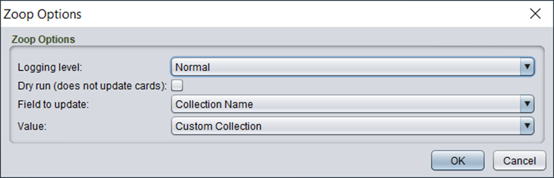

# Bulk update

Zoop supports bulk updating a field on a selection of cards. For example, you can use this to set the collection name or icon on your cards instead of having to manually set it one-by-one on each card.

## Usage

The bulk update option is available in the right click menu like the other functions.

You will see the following options:

The options are

| Option | Details |
| ---- | ---- |
| Logging Level	| Generally, you can leave this on Normal. If you want more details or feedback on the process set it to the other options for more logging. This does not impact the behaviour or output in any way |
| Dry run | This option is enabled by default. When enabled the process will do the actual work, but not update any cards. It is recommended you test the tool with this option to check the numbering is suitable before applying it by running again with Dry Run disabled.
| Field to update	| The field you wish to update on the selected cards |
| Value | The value to update the selected field to on all the selected cards. The option for this will change based on the selected fields. For example some fields will be a simple text or number input. Others will provide a specific drop down |
