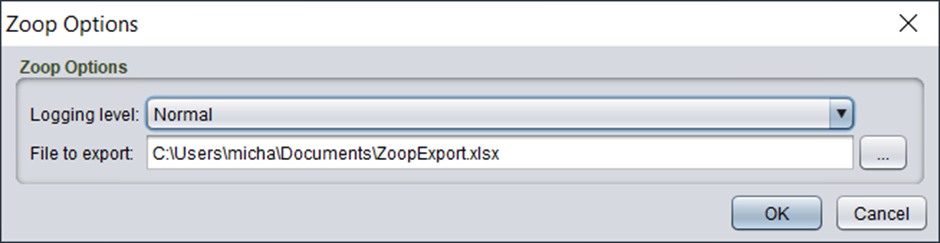

# Export and import (Excel)

Zoop supports exporting a selection of cards to an Excel file and a corresponding import function. For example, you can use this to translate free-text fields in a Strange Eons project in the spreadsheet and import the new values back in to create an alternate translation.

The export/import option is available in the right click menu like the other functions. It has two sub-options, one for exporting and one for importing.

**Important**: Zoop does NOT support importing an Excel created with an older version of Zoop. If you have substantial changes in progress do not upgrade Zoop to a newer version until you have imported those changes.

## Usage - export

For the export you will see the following options

The options are

| Option | Details |
| ---- | --- |
| Logging Level | Generally, you can leave this on Normal. If you want more details or feedback on the process set it to the other options for more logging. This does not impact the behaviour or output in any way |
| File to export | The target file path to export to. If the file does not exist it will be created. Otherwise, it will be overwritten. |

Clicking OK will execute the export.

Because different card types have different fields the resulting Excel file will have one or more tabs to allow different structures. The tab names are relatively self-explanatory.

The columns with a red background **must not** edited as they are used by the import function.

## Usage - import

For the import you will see the following options

| Option | Details |
| ---- | --- |
| Logging Level | Generally, you can leave this on Normal. If you want more details or feedback on the process set it to the other options for more logging. This does not impact the behaviour or output in any way |
| Dry run | This option is enabled by default.

When enabled the process will do the actual work, but not update any cards. **It is recommended you test the tool with this option to check the numbering is suitable before applying it by running again with Dry Run disabled.** |
| File to import | The target file to import |

Clicking OK will execute the import. You can see exactly what is being updated in the progress dialog.
