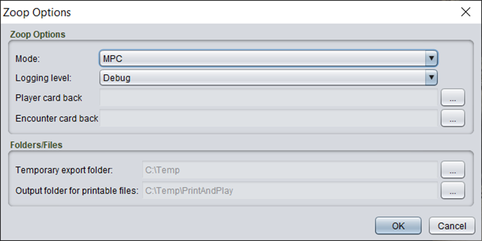

# Print and play

Zoop supports bulk exporting a Strange Eons project to image files in a local directory. Primarily this is for print and play purposes but could be used for other needs where you want a copy of the image files locally.

**Please thoroughly check any output produced by this function. While Zoop will endeavour to produce the correct output based on the specified settings bugs do happen.**

This mode supports multi-select of folders to export a flexible selection of your content in one batch.

Zoop supports the following print and play export modes
-	MPC – This produces files compatible with the MPC plugin for the chrome browser. The chrome plugin supports automated upload of files to the MPC website for printing

## Instructions

This tool will obey [instructions](../shared/instructions/Instructions.md) defined on the cards.

## Usage

Right click on a folder in Strange Eons. You will see a right click option under the Zoop menu to **Exports to print and play files**.

The options are

| Option | Details |
| ---- | ---- |
| Mode | The options are - MPC – creates files compatible with the chrome browser plugin for creating MPC projects. - Print Ready - creates individual files
| Logging Level | Generally, you can leave this on Normal. If you want more details or feedback on the process set it to the other options for more logging. This does not impact the behaviour or output in any way |
| Player card back | Specify a local file to use as the player card back in the output. Zoop includes a default image but you may wish to use a different one. |
| Encounter card back	| Specify a local file to use as the encounter card back in the output. Zoop includes a default image but you may wish to use a different one. |
| Temporary export folder | A folder where Strange Eons can export the files. This is a staging area so a temporary folder such as C:\Temp or equivalent is suitable. |
| Output folder for printable files | A folder where you want the final output files placed. |

After clicking OK you will see a second set of options for selecting [image quality](../shared/imageoptions/ExportImageOptions.md).

You will then see a [progress dialog](../shared/progressdialog/ProgressDialog.md) showing details of the Zoop process. It will likely take several minutes the first time as each image has to be exported. On subsequent runs caching is used to skip any files that have not changed, significantly increasing the performance.

## MPC output details

Zoop’s MPC output mode is designed to work with the chrome extension that automatically converts files into an MPC project, based on the filenames. The MPC output has the following functions

- Landscape cards are rotated 90 degrees (front counter-clockwise, back clockwise)
-	The collection number is used to guide the order of the output
-	Each card title comprises
    - The collection number of the card (zero padded to 3 digits)
        - If a range is used, e.g. 001-003, this will be produced with each number zero padded to 3 digits
    - Act and Agenda + number if relevant
    - A title stripped of any special characters
    - A unique id to handle cards where the above combination clashes
    - An optional “x?” suffix to produce multiple copies of the same card
    - A -1 or -2 suffix for the front and back of a card respectively
    - A back.png/jpg file for the most common type of back (player or encounter)
        - Other cards that have this ‘back’ type have the -2 suffixed output file omitted

Because of how collection numbering is used to produce a sensible output for the print and play you may wish to use Zoop’s automatic collection numbering tool before performing the output, if the source content has not already been numbered.

## Instructions

You can specify [instructions](../shared/instructions/Instructions.md) on cards to alter the behaviour of the export.
