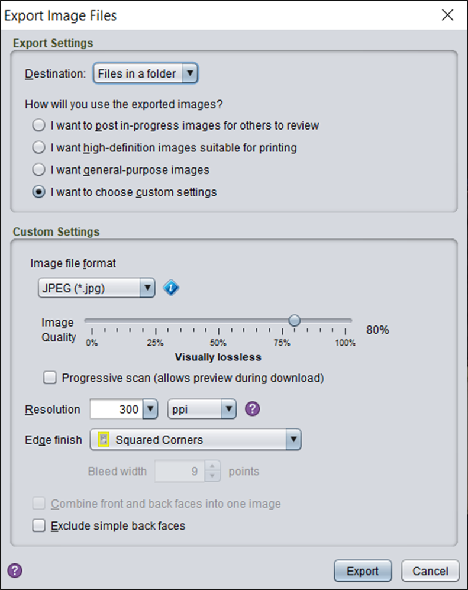

# Export image options

When using a Zoop function that exports the card images, such as the Export to TTS option you will be presented with the following option screen

Note that this screen has been copied from the SE bulk export plug-in and the image output should be identical to that produced by a regular Strange Eons export.

Some of the options, Exclude simple back faces, are ignored by Zoop.
