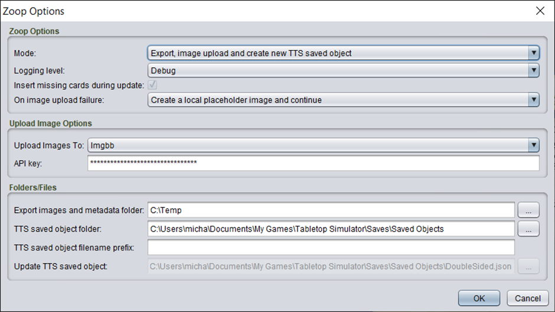

# Exporting to TTS

**Zoop makes a minor modification to your project’s .eon files. It is strongly recommended to make a backup of your project files/directory before using this tool**

The primary features of the TTS export mode are:

- Automated export from Strange Eons and upload of card images to a cloud host, such as imgur, imgbb or dropbox
-	Creating of a Tabletop Simulator (TTS) saved object of the cards, linked to the uploaded images
-	Updating an existing TTS saved object to support merging in incremental changes from Strange Eons
-	Population of metadata used by SCED for snap points, clue spawning, location connections and more

## Typical workflow

This function has two primary modes of operation

1. Exporting content from Strange Eons to a new TTS saved object
2. Updating an existing TTS saved object with changes

The typical workflow is to run the first mode once to create your TTS saved object. Subsequently any changes you make to your Strange Eons project you use the second mode to incrementally add those changes to your existing saved object. This includes introducing new cards and updating existing cards.

The update mode tracks and updates cards individually. The updating will work in all of these situations

- A card has been placed into a different deck than the original import
- A card has been removed from a deck completely
- A card has been placed inside a container, such as a memory bag
- Cards have been copied from one saved object to another

In other words you are free to manipulate the individual cards as you see fit within a saved object and the update mode will still be able to locate and update them.

## Usage

Zoop will export everything within a folder, including all sub folders. In SE, right click on the folder whose contents you wish to export. For the entire project, right click on the top most folder. The Zoop option should appear in the context menu. Click the Export content to TTS option.

You will then see an options screen

The options are

| Option | Details |
| ---- | ----- |
| Mode | The mode options are described after this table in more detail |
| Logging Level | Generally, you can leave this on Normal. If you want more details or feedback on the process set it to the other options for more logging. This does not impact the behaviour or output in any way
| Insert missing cards during update | This option is only available when updating an existing saved object. Enabling it will have Zoop search for a bag in your saved object called TtsZoopMissing (case sensitive). Any cards in Strange Eons that are not present in your saved object will be dropped into this bag. This provides an option for quickly integrating new content to your existing saved object. The TtsZoopMissing bag can be anywhere in the saved object, e.g., inside other containers). If the bag TtsZoopMissing is not found you will see an error in the Zoop log window and it will list all the files it could not add. |
| On image upload failure | This option defines the behaviour when an image upload fails, typically due to rate limiting or other image host error. The default behaviour is Fail which will terminate the Zoop process immediately. The Create a local placeholder image and continue option will create a local image on your PC that will be used instead. This image will have a red background with the text of the card title, type on it. While not the real image it allows a content creator to continue building within TTS while waiting for the image host issue to resolve itself. Because this image is local to your computer only, it will not work if you attempt to share the saved object or play with others on a hosted TTS server.
| Upload images to | Selects the cloud host to upload card images. See the FAQ for how to create your own free imgur or imgbb account. See the FAQ for how to generate an access token for a dropbox account. The Always fail option is primarily for testing and should not be used for normal usage. Both imgbb and imgur implement rate limiting. Therefore, when uploading a lot of new files you may run into an error that mentions a non-200 status was returned and a message mentioning rate limiting. If this happens, either wait a period of time (minutes/hours) and try again or switch to the other cloud host
| API Key | The API key of the selected cloud host. When you create an account in one of the above cloud hosts there will be an option to view/generate this key |
| Export images and metadata folder | The folder on your local computer where you want Zoop to export all the card images. A temporary area such as C:\Temp is appropriate for this. |
| TTS saved object folder | The location of the TTS saved object folder where the output TTS saved object file will be created. On windows this is usually in Documents\My Games\Tabletop Simulator\Saves\Saved Objects. This option is only available when using the create saved object mode |
| TTS saved object filename prefix | Files are created with a default prefix of TtsZoop- followed by a timestamp. If this option is set it will replace the TtsZoop- default prefix. |
| Update TTS saved object | The location a TTS saved object to update with your project. The saved objects are stored in a folder. On windows this is usually in Documents\My Games\Tabletop Simulator\Saves\Saved Objects. This option is only available when using the update saved object mode |

### Modes

The available modes are

- Export, image upload and create new TTS saved object – the full process that will result in a new TTS saved object with the selected content exported
-	Export, image upload and update existing TTS saved object – will update changes directly into an existing TTS saved object
-	Export images – only exports images. Generally you won't use this

Click OK to proceed.

### Image export

After selecting the Zoop options you will be asked to select the options for the [Image Export](../shared/imageoptions/ExportImageOptions.md)

You will then see the [progress dialog](../shared/progressdialog/ProgressDialog.md).

### Output

**Creating a new TTS saved object**

If you have selected the option to create a new TTS saved object, on completion a TTS saved object will be created in the specified folder. Open TTS and open the saved object menu. You should find a file called TtsZoop-<timestamp>. Where <timestamp> is the date/time the export was done in a basic format.

The created content is 1 bag for each folder in your SE project. Each bag will contain further bags for any sub-folders in each folder and a single deck of cards for any cards in that folder.

**Updating an existing TTS saved object**

If you have selected the option to update an existing TTS saved object, Zoop will directly update the select saved object, modifying any data that has changed, for example the image URLs of a card.

Zoop assigns a unique id to each card in SE when it runs. This id does not change once created. When Zoop creates a saved object, this id is written into the TTS saved object file.

During the update process the target TTS saved object file is scanned and any cards that have an id are matched back to the corresponding card in SE. The card data between the two is compared to see if anything has changed (e.g. card title, description, front face image or back face image). If anything has changed Zoop updates the card information in the saved object.

Any cards in the Strange Eons project that are not in the saved object may be added in if the relevant option has been enabled. See the detailed options above.

Before Zoop updates the saved object that will the same name and location as your saved object file with <timestamp>.backup appended to the end of the filename.
